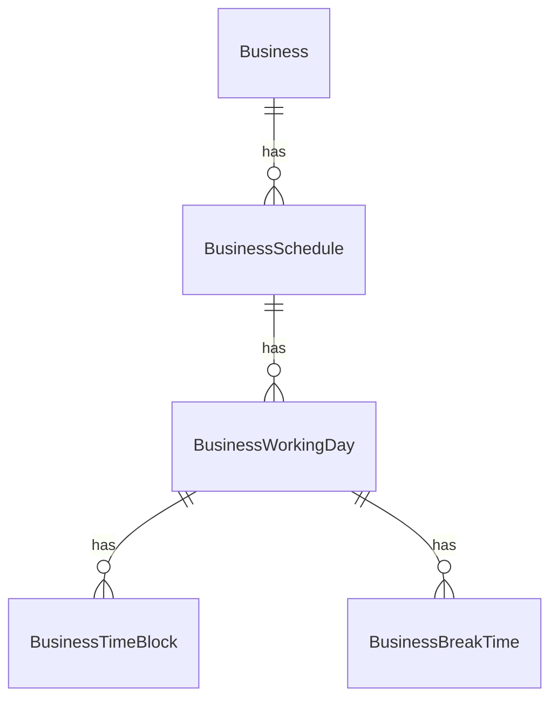

# Modelo relacional para horarios de atención

## Entidades principales

- **BusinessSchedule**
  - Id (Guid)
  - BusinessId (Guid, FK)
  - AppointmentDuration (int, minutos)

- **BusinessWorkingDay**
  - Id (Guid)
  - BusinessScheduleId (Guid, FK)
  - DayOfWeek (int, 0=Lunes ... 6=Domingo)
  - IsOpen (bool)

- **BusinessTimeBlock**
  - Id (Guid)
  - WorkingDayId (Guid, FK)
  - StartTime (TimeSpan)
  - EndTime (TimeSpan)

- **BusinessBreakTime**
  - Id (Guid)
  - WorkingDayId (Guid, FK)
  - StartTime (TimeSpan)
  - EndTime (TimeSpan)

## Relaciones
- Un negocio tiene un horario (BusinessSchedule)
- Un horario tiene varios días configurados (BusinessWorkingDay)
- Cada día puede tener varios bloques de atención (BusinessTimeBlock)
- Cada día puede tener varios bloques de descanso (BusinessBreakTime)

---

## Diagrama de entidades (simplificado)

---

## Siguiente paso
- Crear las clases de entidad en `TurnoYa.Core/Entities`
- Crear la migración EF Core
- Actualizar el DbContext
- (Luego) Crear los endpoints CRUD
