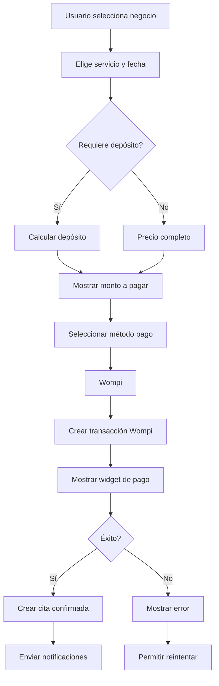
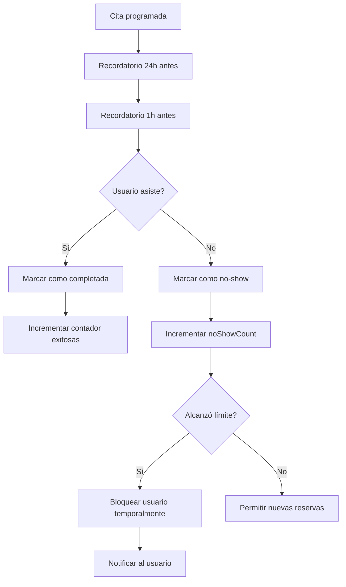

# TurnoYa · App de Reservas

Experiencia rápida y confiable para reservar servicios (barberías, salones, spas) con pagos seguros vía Wompi y gestión completa para negocios.

<!-- markdownlint-disable MD033 MD022 MD032 MD031 MD029 -->

---

## 📋 Tabla de Contenidos

- [🗃️ Estructura de Base de Datos](#%EF%B8%8F-estructura-de-base-de-datos)
  - [users/{userId}](#usersuserid)
  - [businesses/{businessId}](#businessesbusinessid)
  - [appointments/{appointmentId}](#appointmentsappointmentid)
  - [reviews/{reviewId}](#reviewsreviewid)
  - [wompi_transactions/{transactionId}](#wompi_transactionstransactionid)
- [🗺️ Plan de Desarrollo Paso a Paso](#%EF%B8%8F-plan-de-desarrollo-paso-a-paso)
- [🏗️ Arquitectura Técnica Mejorada](#%EF%B8%8F-arquitectura-t%C3%A9cnica-mejorada)
- [🔄 Flujos de Negocio Detallados](#-flujos-de-negocio-detallados)
- [💳 Configuración de Wompi](#-configuraci%C3%B3n-de-wompi)
- [💰 Monetización y Estrategia](#-monetizaci%C3%B3n-y-estrategia)
- [🚀 Próximos Pasos Inmediatos](#-pr%C3%B3ximos-pasos-inmediatos)

> Nota: Todo el contenido fue reestructurado para mayor claridad sin alterar su esencia.

---

## 🗃️ Estructura de Base de Datos

### Firestore Collections

#### `users/{userId}`

<details>
<summary>Ver esquema de <code>users/{userId}</code></summary>

```javascript
{
  // Información básica
  basicInfo: {
    firstName: string,
    lastName: string,
    email: string,
    phone: string,
    photoURL: string,
    dateOfBirth: timestamp,
    gender: "male" | "female" | "other",
    createdAt: timestamp,
    lastLogin: timestamp
  },
  
  // Historial y reputación
  reputation: {
    noShowCount: number,
    completedAppointments: number,
    isBlocked: boolean,
    blockReason: string,
    blockUntil: timestamp,
    rating: number // promedio de ratings de negocios
  },
  
  // Preferencias
  preferences: {
    favoriteBusinesses: array[string], // businessIds
    preferredPaymentMethod: "wompi" | "cash",
    notificationSettings: {
      pushEnabled: boolean,
      emailEnabled: boolean,
      smsEnabled: boolean,
      reminderTime: number // minutos antes
    }
  },
  
  // Métodos de pago guardados (para Wompi)
  paymentMethods: [{
    id: string,
    type: "card" | "nequi" | "daviplata",
    lastFour: string,
    isDefault: boolean,
    wompiToken: string
  }],
  
  // Direcciones frecuentes
  addresses: [{
    id: string,
    name: string,
    address: string,
    location: { lat: number, lng: number },
    isDefault: boolean
  }]
}
```

</details>

#### `businesses/{businessId}`

<details>
<summary>Ver esquema de <code>businesses/{businessId}</code></summary>

```javascript
{
  // Información básica del negocio
  basicInfo: {
    name: string,
    description: string,
    category: "barber" | "salon" | "spa" | "nail" | "other",
    subcategory: array[string], // ["cortes", "barba", "tintes"]
    phone: string,
    email: string,
    website: string,
    logoURL: string,
    coverPhotoURL: string,
    createdAt: timestamp,
    isActive: boolean,
    verified: boolean
  },
  
  // Ubicación
  location: {
    address: string,
    city: string,
    department: string,
    country: "CO",
    coordinates: { lat: number, lng: number },
    geohash: string // Para queries geoespaciales
  },
  
  // Dueño/Administrador
  owner: {
    ownerId: string, // Reference to users collection
    ownerEmail: string,
    ownerPhone: string
  },
  
  // Horarios
  schedule: {
    timezone: "America/Bogota",
    businessHours: {
      monday: { open: string, close: string, isClosed: boolean },
      tuesday: { open: string, close: string, isClosed: boolean },
      wednesday: { open: string, close: string, isClosed: boolean },
      thursday: { open: string, close: string, isClosed: boolean },
      friday: { open: string, close: string, isClosed: boolean },
      saturday: { open: string, close: string, isClosed: boolean },
      sunday: { open: string, close: string, isClosed: boolean }
    },
    breaks: [{
      name: string,
      startTime: string,
      endTime: string,
      days: array[string] // ["monday", "tuesday"]
    }],
    specialDays: [{
      date: timestamp,
      name: string,
      isHoliday: boolean,
      open: string | null,
      close: string | null
    }]
  },
  
  // Servicios
  services: [{
    id: string,
    name: string,
    description: string,
    duration: number, // minutos
    price: number,
    currency: "COP",
    category: string,
    isActive: boolean,
    requiresDeposit: boolean,
    depositAmount: number
  }],
  
  // Empleados
  employees: [{
    id: string,
    name: string,
    email: string,
    phone: string,
    photoURL: string,
    services: array[string], // serviceIds
    schedule: {
      // Horario específico del empleado
    },
    isActive: boolean
  }],
  
  // Políticas
  policies: {
    noShowPolicy: {
      type: "none" | "block" | "deposit",
      depositAmount: number,
      maxNoShows: number,
      blockDuration: number // días
    },
    cancellationPolicy: {
      allowCancellation: boolean,
      freeCancellationHours: number,
      lateCancellationFee: number
    }
  },
  
  // Métodos de pago aceptados
  paymentMethods: {
    wompi: {
      enabled: boolean,
      acceptCards: boolean,
      acceptNequi: boolean,
      acceptDaviplata: boolean,
      acceptPSE: boolean
    },
    cash: {
      enabled: boolean
    }
  },
  
  // Configuración de reservas
  bookingSettings: {
    slotDuration: number, // minutos
    bufferTime: number, // minutos entre citas
    maxAdvanceBooking: number, // días
    minAdvanceBooking: number, // minutos
    simultaneousBookings: number // citas simultáneas
  },
  
  // Estadísticas y rating
  stats: {
    totalAppointments: number,
    completedAppointments: number,
    cancellationRate: number,
    averageRating: number,
    totalReviews: number,
    revenue: number
  },
  
  // Suscripción
  subscription: {
    plan: "free" | "premium" | "enterprise",
    status: "active" | "inactive" | "trial",
    trialEnds: timestamp,
    features: {
      maxEmployees: number,
      maxServices: number,
      advancedAnalytics: boolean,
      priorityListing: boolean,
      customBranding: boolean
    }
  }
}
```

</details>

#### `appointments/{appointmentId}`

<details>
<summary>Ver esquema de <code>appointments/{appointmentId}</code></summary>

```javascript
{
  // Información básica
  basicInfo: {
    reference: string, // Referencia única
    createdAt: timestamp,
    updatedAt: timestamp
  },
  
  // Participantes
  participants: {
    userId: string,
    businessId: string,
    employeeId: string, // opcional
    serviceId: string
  },
  
  // Detalles de la cita
  details: {
    serviceName: string,
    serviceDuration: number,
    servicePrice: number,
    scheduleDate: timestamp,
    endDate: timestamp, // calculated
    notes: string // notas del cliente
  },
  
  // Estado
  status: {
    current: "pending" | "confirmed" | "completed" | "cancelled" | "no-show",
    history: [{
      status: string,
      timestamp: timestamp,
      reason: string,
      changedBy: "user" | "business" | "system"
    }]
  },
  
  // Pagos
  payment: {
    method: "wompi" | "cash",
    status: "pending" | "paid" | "unpaid" | "refunded" | "partially_refunded",
    amount: number,
    currency: "COP",
    wompiTransactionId: string,
    wompiReference: string,
    depositAmount: number, // si aplica
    depositPaid: boolean,
    paymentDetails: {
      // Detalles específicos del pago
    }
  },
  
  // Notificaciones
  notifications: {
    reminderSent: boolean,
    reminderTime: timestamp,
    confirmationSent: boolean
  },
  
  // Rating y revisión
  review: {
    rating: number, // 1-5
    comment: string,
    createdAt: timestamp,
    businessReply: string,
    repliedAt: timestamp
  }
}
```

</details>

#### `reviews/{reviewId}`

<details>
<summary>Ver esquema de <code>reviews/{reviewId}</code></summary>

```javascript
{
  appointmentId: string,
  userId: string,
  businessId: string,
  rating: number,
  comment: string,
  photos: array[string], // URLs de fotos
  createdAt: timestamp,
  updatedAt: timestamp,
  businessReply: {
    comment: string,
    repliedAt: timestamp
  },
  likes: number,
  reported: boolean,
  status: "active" | "hidden"
}
```

</details>

#### `wompi_transactions/{transactionId}`

<details>
<summary>Ver esquema de <code>wompi_transactions/{transactionId}</code></summary>

```javascript
{
  appointmentId: string,
  userId: string,
  businessId: string,
  wompiReference: string,
  wompiId: string,
  amount: number,
  currency: "COP",
  status: "PENDING" | "APPROVED" | "DECLINED" | "ERROR" | "VOIDED",
  paymentMethod: {
    type: "CARD" | "NEQUI" | "DAVIPLATA" | "PSE",
    extra: object // información específica del método
  },
  customer: {
    email: string,
    name: string,
    phone: string
  },
  createdAt: timestamp,
  updatedAt: timestamp,
  webhookReceived: boolean,
  webhookData: object // datos completos del webhook
}
```

</details>

---

## 🗺️ Plan de Desarrollo Paso a Paso

### Fase 1: Setup y Configuración (Semanas 1-2)

#### Semana 1: Configuración Inicial

1. Crear proyecto Firebase

```bash
firebase projects:create turnoya-app
firebase init firestore
firebase init functions
firebase init hosting
```

2. Configurar Wompi Sandbox

```javascript
// functions/config/wompi.js
const WOMPI_CONFIG = {
  sandbox: {
    publicKey: 'pub_test_xxxxxxxxxxxxxxxx',
    privateKey: 'prv_test_xxxxxxxxxxxxxxxx',
    baseURL: 'https://sandbox.wompi.co/v1'
  },
  production: {
    publicKey: 'pub_prod_xxxxxxxxxxxxxxxx',
    privateKey: 'prv_prod_xxxxxxxxxxxxxxxx',
    baseURL: 'https://production.wompi.co/v1'
  }
};
```

3. Configurar Google Maps API

- Activar Places API
- Activar Geocoding API
- Acturar Maps JavaScript API

4. Estructura inicial de Ionic

```bash
ionic start turnoya tabs --type=angular --capacitor
npm install @angular/fire firebase @capacitor/geolocation
```

#### Semana 2: Autenticación y Base de Datos

1. Implementar Firebase Auth

- Email/password
- Google Sign-In
- Phone authentication

2. Crear estructuras de datos iniciales

- Models en Angular
- Services base
- Guards de autenticación

3. Configurar Cloud Functions básicas

- Triggers de usuario
- Validaciones

### Fase 2: Módulo de Negocios (Semanas 3-5)

#### Semana 3: Perfil de Negocio
1. Formulario de registro de negocio
- Información básica
- Ubicación con mapa
- Horarios y servicios
2. Dashboard del negocio
- Vista general
- Estadísticas básicas

#### Semana 4: Gestión de Servicios y Empleados
1. CRUD de servicios
2. Gestión de empleados
3. Configuración de horarios

#### Semana 5: Políticas y Configuración
1. Sistema de políticas de no-show
2. Configuración de pagos
3. Suscripciones y planes

### Fase 3: Módulo de Usuario (Semanas 6-8)

#### Semana 6: Búsqueda y Geolocalización
1. Mapa interactivo
- Geolocalización
- Filtros y búsqueda
- Pines de negocios
2. Perfil de negocio público
- Información detallada
- Reviews y ratings

#### Semana 7: Sistema de Reservas
1. Flujo de reserva completo
- Selección de servicio
- Elección de fecha/hora
- Confirmación
2. Gestión de citas del usuario
- Historial
- Cancelaciones
- Re-programaciones

#### Semana 8: Sistema de Pagos
1. Integración con Wompi
- Transacciones
- Webhooks
- Manejo de estados
2. Pago en efectivo
- Flujo simplificado
- Confirmaciones

### Fase 4: Features Avanzados (Semanas 9-12)

#### Semana 9: Notificaciones y Recordatorios
1. Firebase Cloud Messaging
2. Sistema de recordatorios
3. Notificaciones push

#### Semana 10: Sistema Anti No-Show
1. Lógica de reputación
2. Sistema de depósitos
3. Bloqueos automáticos

#### Semana 11: Reviews y Rating
1. Sistema de reviews
2. Manejo de respuestas
3. Moderación

#### Semana 12: Testing y Optimización
1. Testing completo
2. Optimización de performance
3. Preparación para launch

---

## 🏗️ Arquitectura Técnica Mejorada

### Estructura de Cloud Functions
```text
functions/
├── src/
│   ├── config/
│   │   ├── firebase.ts
│   │   ├── wompi.ts
│   │   └── maps.ts
│   ├── triggers/
│   │   ├── users.ts
│   │   ├── businesses.ts
│   │   ├── appointments.ts
│   │   └── reviews.ts
│   ├── services/
│   │   ├── wompiService.ts
│   │   ├── notificationService.ts
│   │   ├── geolocationService.ts
│   │   └── paymentService.ts
│   ├── webhooks/
│   │   └── wompiWebhook.ts
│   └── utils/
│       ├── validators.ts
│       ├── helpers.ts
│       └── constants.ts
```

### Estructura de Ionic/Angular
```text
src/
├── app/
│   ├── core/
│   │   ├── services/
│   │   ├── guards/
│   │   ├── interceptors/
│   │   └── models/
│   ├── features/
│   │   ├── auth/
│   │   ├── business/
│   │   ├── booking/
│   │   ├── payment/
│   │   └── profile/
│   ├── shared/
│   │   ├── components/
│   │   ├── pipes/
│   │   └── directives/
│   └── pages/
│       ├── tabs/
│       └── modals/
```

---

## 🔄 Flujos de Negocio Detallados

### Flujo de Reserva con Pago Wompi


### Flujo Anti No-Show


---

## 💳 Configuración de Wompi

> Importante: Mantén llaves privadas fuera del repo (usa `firebase functions:config:set` o variables de entorno). Las claves mostradas son placeholders.

### Implementación en Cloud Functions
```typescript
// functions/src/services/wompiService.ts
export class WompiService {
  private baseURL: string;
  private publicKey: string;
  private privateKey: string;

  constructor(environment: 'sandbox' | 'production' = 'sandbox') {
    const config = WOMPI_CONFIG[environment];
    this.baseURL = config.baseURL;
    this.publicKey = config.publicKey;
    this.privateKey = config.privateKey;
  }

  async createTransaction(transactionData: any) {
    const response = await fetch(`${this.baseURL}/transactions`, {
      method: 'POST',
      headers: {
        'Authorization': `Bearer ${this.publicKey}`,
        'Content-Type': 'application/json'
      },
      body: JSON.stringify(transactionData)
    });
    return await response.json();
  }

  async verifyTransaction(transactionId: string) {
    const response = await fetch(`${this.baseURL}/transactions/${transactionId}`, {
      headers: {
        'Authorization': `Bearer ${this.publicKey}`
      }
    });
    return await response.json();
  }
}
```

### Webhook de Wompi
```typescript
// functions/src/webhooks/wompiWebhook.ts
export const wompiWebhook = functions.https.onRequest(async (req, res) => {
  try {
    const signature = req.headers['signature'];
    const event = req.body;
    
    // Validar firma
    if (!validateSignature(signature, event)) {
      return res.status(401).send('Invalid signature');
    }

    // Procesar evento
    await processWompiEvent(event);

    res.status(200).send('Webhook received');
  } catch (error) {
    console.error('Webhook error:', error);
    res.status(500).send('Error processing webhook');
  }
});
```

---

## 💰 Monetización y Estrategia

### Modelo de Ingresos
1. Comisión por Transacción (2.5%)
   - Aplicable solo a pagos con Wompi
   - Transparente para el usuario
2. Suscripciones para Negocios
```javascript
PLANS = {
  free: {
    price: 0,
    features: ['1 empleado', '5 servicios', 'Búsqueda básica']
  },
  premium: {
    price: 49900, // COP/mes
    features: ['5 empleados', 'Servicios ilimitados', 'Estadísticas avanzadas']
  },
  enterprise: {
    price: 99900, // COP/mes
    features: ['Empleados ilimitados', 'Múltiples sucursales', 'Soporte prioritario']
  }
}
```
3. Publicidad
   - Banners en la app
   - Negocios destacados
   - Promociones patrocinadas

### Roadmap de Lanzamiento
- MVP (3 meses)
  - Registro de usuarios y negocios
  - Sistema básico de reservas
  - Pagos con Wompi
  - Notificaciones push
- V1.1 (6 meses)
  - App nativa con Capacitor
  - Sistema de reviews
  - Analytics para negocios
  - Múltiples sucursales
- V1.2 (9 meses)
  - Programa de fidelidad
  - Integración con redes sociales
  - Reportes avanzados
  - API pública

---

## 🚀 Próximos Pasos Inmediatos
1. ✅ Crear proyecto Firebase
2. ✅ Configurar Wompi Sandbox
3. 🔲 Inicializar proyecto Ionic
4. 🔲 Implementar autenticación básica
5. 🔲 Crear estructuras de datos iniciales

<p align="right"><a href="#turnoya-%C2%B7-app-de-reservas">Volver arriba ▲</a></p>
